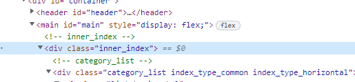
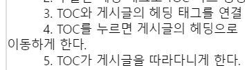

# TistoryToc

## 목차

- [목적](#목적)
- [목표](#목표)
- [사용 방법](#사용방법)
- [과정](#과정)
- [테마적용](#테마적용)
  - [Letter](#레터)
  - [PureBlack](#퓨어블랙)

## 목적
현재 블로그에 TOC를 적용할 수 있도록, TOC를 처음부터 만든다.

## 목표
- 블로그에 TOC를 라이브러리 없이 제작한다.
- 대상은 사용중인 티스토리 블로그와 현재 선택한 블로그 스킨(Letter)이다.
- TOC를 선택하면 해당 문단으로 이동하는 등의 기본적인 기능을 추가한다.

## 사용방법
- 티스토리 어드민 페이지에서 `스킨 편집`을 누른다
- 우측에 나오는 `html 편집`을 누른다.
- 상단 `HTML`탭을 누르고 가장 하단으로 이동
- `</html>` 태그 바로 위에 `<script>`태그를 생성하여 toc.js의 코드를 복사 붙여넣기 한다.

## 과정
티스토리 블로그는 관리자 메뉴에서 스킨 편집을 할 수 있다. 편집을 누르면, HTML과 CSS를 수정할 수 있고, 필요한 파일을 업로드할 수 있도록 되어 있다. 이에 HTML 탭 하단에 자바스크립트 코드를 추가하여 만들기 시작했다.

### 1. 게시글의 헤딩 태그 추출
처음엔 바로 헤딩 태그를 모두 가져왔다. 이렇게 하면, 게시글뿐만 아니라 문서에 있는 다른 헤딩 태그들까지 가져오게 된다. 따라서 doucmnet를 기준으로 하는 게 아니라, 게시글에 있는 헤딩태그를 포함하면서 다른 헤딩 태그는 포함하지 않는 상위 엘리먼트를 지정해야 한다.

게시글의 헤딩 태그가 어떻게 구성되는지 확인하기 위해서 테스트 게시글을 작성하고 크롬 개발자도구를 사용했다. 상위 엘리먼트를 찾고, 그 엘리먼트를 기준으로 다시 헤딩태그를 찾으니 게시글에 속한 헤딩태그만을 가져올 수 있었다.

### 2. 헤딩 태그로 TOC 박스 생성
가져온 헤딩 태그를 이용하여 TOC를 담는 박스를 만들어야 한다. 별생각 없이 만들다가 고려할 점이 몇 가지 있는 것을 생각했다.

- TOC에 담는 내용은 게시글의 헤딩 태그이다. 즉, 헤딩 태그로  쓴 글의 길이에 따라 TOC의 넓이가 가변적이다.
- 헤딩 태그를 몇 개나 쓸 수 있을지 모른다. 따라서 높이도 가변적이다.
- 가변적이지만, 너무 넓으면 게시글을 가리고 너무 좁으면 TOC의 가독성이 떨어진다.

TOC의 넓이가 가변적이지만, 너무 넓어서도 안되고 너무 좁아서도 안된다. 이 조건은 css에 min-width와 max-height 속성을 같이 줘서 해결했다. TOC의 높이가 가변적인 것은 박스의 높이가 컨텐츠의 높이를 따라가므로 특별히 처리할 부분이 없었다. 박스의 배경 색상을 지정해 보았지만, 게시글에 비해서 눈에 너무 잘 띄는 것 같아서 게시글과 같은 색상으로 변경하였다. 대신, TOC에 마우스 커서가 올라가면 글씨가 진해지고 배경 색상이 회색으로 변하도록 했다. 그리고, TOC 왼편에 세로줄을 추가하였다.

### 3. TOC 박스에 헤딩 태그 내용 담기
생성한 박스 안에 헤딩 태그의 내용을 담아야 한다. 고려해야 할 점은 헤딩 태그 간에 위계가 있다는 점이다. h1과 h2, h2와 h3... 는 모두 다르게 표시되어야 한다. 이를 위해서, h6으로 갈수록 들여 쓰기가 더 커지도록 하였다. 처음엔 헤딩 태그의 내용 앞에 빈 공간을 만들도록 문자열을 추가하였다. 그러나, 다음 줄로 글이 넘어가면, 다음 줄의 첫 번째 글자에는 영향을 주지 않았다.

    

해결 방법은 padding-left을 추가해서 해결하였다. 헤딩이 작아질수록, 더 길어진 padding-left를 갖는 방향이다.

### 4. TOC를 누르면 게시글로 이동
TOC를 눌렀을 때, 해당 게시글로 이동하려면 a태그와 href 어트리뷰트를 사용하면 된다. 이를 위하여, 각 헤딩 태그에 id를 지정하고 TOC에도 동일하게 id 정보를 저장해 주면 된다. 그런데, a태그를 사용하면 해당 글로 점프하게 된다. 해당 글로 이동하는 것으로 목표는 달성했지만, 뭔가 안 맞는다는 느낌이 든다. 우리가 글을 읽을 때, 마우스로 스크롤을 하면서 위에서 아래로 혹은 아래에서 위로 가는 게 일반적이다. 따라서, 점프보다는 스크롤로 이동하는 느낌에 좀 더 익숙함과 편안함을 느끼는 것 같다. 따라서, a태그 대신에 scrollIntoView 메서드를 적용하였다.

TOC를 눌러서 게시글로 이동했다면, 현재 어떤 TOC가 활성화된 것인지 보여주기 위해 가장 최근에 클릭한 TOC를 기억하도록 하였다. 이 TOC는 커서가 올라갔을 때랑 동일하게 포커스 된 느낌을 동일하게 지정하였다.

### 5. TOC가 게시글을 따라다니게 한다.
TOC를 눌러서 게시글로 이동하면, TOC는 사라지게 된다. 목차를 다시 보기 위해 스크롤을 위로 올리는 것은 불편한 일이니 TOC가 화면을 따라가게 하는 방향으로 하였다. 이를 위하여 TOC 박스의 CSS에 position sticky를 적용하였다. 그러나, 생각대로 동작하진 않았다. 이것은 TOC 박스의 위치를 게시글과 균일하게 배치하기 위하여, flex를 쓴 것이 원인이었다. TOC박스와 게시글을 포함하는 상위 엘리먼트가 flex 컨테이너가 되고, TOC박스가 flex 아이템이 된다. flex 아이템의 기본 설정은 stretch이기에 해당 칸은 세로로 모두 차있으므로, 스크롤을 내려도 따라오지 않는 것이다. 이를 위하여 align-items 속성을 flex-start로 지정하였다.

### 6. 스크롤로 게시글을 이동할 때, 어떤 TOC와 연관되었는지 나타낸다.
스크롤을 움직여서 게시글을 이동할 때, 현재 어떤 글을 보고 있는지 TOC에 나타내게 하고 싶었다. viewport 기준으로 가장 가까운 헤딩 태그를 찾아, 이 태그에 맞는 TOC를 활성화해야 한다. 찾아보니 getBoundingClientRect메서드를 사용하면 얻을 수 있었다. 게시글의 헤딩태그를 지닌 엘리먼트를 찾고, 각 엘리먼트들이 viewport기준으로 얼마나 멀리 떨어져 있는 지를 구하여 가장 가까운 엘리먼트를 구한다. 찾은 엘리먼트와 연관된 TOC를 지정하고 활성화하여 구현할 수 있었다.

### 7. TOC를 반응형으로 변경
TOC가 게시글을 따라다니는 형태를 유지하려면, 웹 페이지의 크기가 TOC와 게시글을 모두 담아내도 어색하지 않을 정도여야 한다. 웹 페이지가 일정이상 작아지면, 이 둘을 한 화면에 담아내는 것은 어렵다. 따라서, 웹 페이지의 사이즈를 인식하여 TOC를 사라지게 할 필요가 있었다. 이를 위하여 window.matchMedia 메서드를 사용하고 리스너를 추가하여 구현하였다.

### 생각
프로그래밍하면서 신경 쓴 부분 중에 하나는 js 파일 단일로 유지할 수 있도록 하는 점이었다. 내가 만든 TOC는 기존의 라이브러리보다 심미성, 기능성에서 부족하다. 부족한 점을 조금이라도 보완하려면 적용이라도 쉬어야 하지 않나 싶었다.  그래서 CSS, HTML 파일 없이  js파일 하나로만 작업을 하였다. 적용은 복사 붙여 넣기 1회로 끝난다.

만들면서 몇몇 부분을 잘만하면 여러 스킨에 동시에 적용할 수 있는 점이 보였다. 그런데, 경험상 이 정도 수준에서 코드를 제네릭한 방향으로 짜면, 프로젝트가 늘어졌다. 그래서 바로 제네릭하게 하진 않을 것 같고, 1~2개 정도의 스킨을 처음부터 하면 경험치가 쌓여서 제네릭하게 할 수 있을 것 같다.

## 테마적용
### Letter 
- 시작할 때, 목표로 삼은 스킨이다. 홈화면과 게시글 화면 모두 좌우에 넓은 여백이 있어서 목차를 어느쪽에 둘까... 생각을 해봤다.
- 글을 읽을 때, 좌에서 우로 위에서 아래로 읽는게 기본방향이니 게시글에 집중할 수 있도록 목차는 오른편에 두는게 나아 보였다.

### PureBlack 
- PureBlack 테마에도 적용을 했다. 이 테마에선 TOC가 좌측에 있는게 더 보기에 괜찮아서 옮길 수 있도록 하였다.
- 테마를 하나 늘리긴 했지만... 그 방식이 깔끔하진 않은 것 같다. 설정용 변수를 하나 두고 기존의 함수에서 `config.isRightPosition`을 확인해서 적용을 하는 방향이라 테마가 늘어남에 따라 설정값이 선형적으로 증가할 수 도 있겠다는 생각이 든다.
- 몇개 더 해보고 어떻게 적용할지 생각해봐야겠다.
